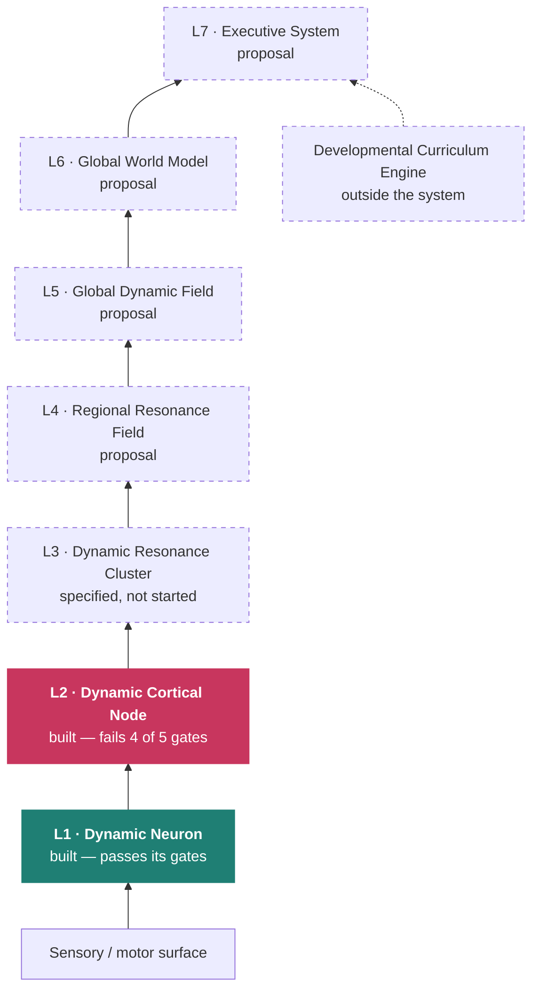

<div align="center">

```
                             __
                         _.-~  )
              _..--~~~~,'   ,-/     _
           .-'. . . .'   ,-','    ,' )
         ,'. . . _   ,--~,-'__..-'  ,'
       ,'. . .  (@)' ---~~~~      ,'
      /. . . . '~~             ,-'
     /. . . . .             ,-'
    ; . . . .  - .        ,'
   : . . . .       _     /
  . . . . .          `-.:
 . . . ./  - .          )
.  . . |  _____..---.._/
 ~---~~~~----~~~~             ~~
```

# 🦢 OCA — Open Cognitive Architecture

**A community-driven open architecture for building the next generation of cognitive AI systems.**

[](LICENSE)
[](https://www.python.org/)
[](https://numpy.org/)
[](tests/)
[](docs/SPEC_ARCHITECTURE.md)
[](#contributing)

*No PyTorch. No pretrained weights. No GPU. One dependency — and every claim ships with the control that could have killed it.*

</div>

---

## Mission

The goal of OCA is not to build another large language model.

The goal is to explore cognitive architectures capable of **continual learning**, **long-term
memory**, **concept formation**, **memory consolidation**, **resonance-based communication**,
**adaptive reasoning**, and **knowledge that evolves over time** — inspired by neuroscience,
but fully computational and engineering-driven.

OCA is meant to be a platform where different cognitive architectures can be designed,
tested, benchmarked, compared and shared in the open.

## Vision

Today's AI is dominated by foundation models, and they are remarkable at what they do. OCA
asks a complementary question:

> **Can intelligence emerge from a modular cognitive architecture, rather than only from
> scaling larger neural networks?**

Nobody here knows. What this project offers is a way to find out that does not depend on
anyone's opinion: a shared, architecture-agnostic benchmark, worlds simple enough to reason
about, and a standing rule that every result is reported with the control that could have
refuted it.

---

## The honest state of the project

Most research repositories open with what works. This one opens with the scoreboard, because
the scoreboard is the contribution.

Three complete architectures, now all frozen, and six levels of gates in:

| finding | status |
|---|---|
| Local, backprop-free learning beats a capacity-matched BPTT GRU on this world | **established** |
| Event-driven emission beats matched-rate controls by 92.9%, and transfers across architectures | **established** |
| Gradient flows cannot oscillate; low-pass filters cannot integrate | **established** — provable in minutes, and each cost a full experimental cycle to find by experiment |
| Emergent object permanence | **refuted by our own measurement** |
| Coalitions as the substrate of thought | **refuted** — synchrony scored exactly 1.00× persistence as a representation |
| "The predictive code is relational, not additive" | **retired** — mean pooling wins at matched width |
| Phase coordination pays off | **no measurable payoff at any level yet** |
| No representation beats raw pixels at predicting an **observable** world | **established** |
| ~~No architecture forms persistent state~~ | **retracted** — the gate was not measurable; see the correction |
| **Corvus integrates its own moves while blind: +57% over its control** | **first floor gate ever passed here** |

The last two rows are the project in miniature, including a retraction. We published that no
architecture forms persistent state, on the strength of a gate that compared models against a
baseline *handed information they must infer* — position is not recoverable from a 5x5 view at all
(4.92 cells while fully sighted, against the baseline's 2.06). Asked fairly, about displacement
rather than position, **Corvus passes at +57.2% over its control across three seeds**, Wren turns
out to have been partially integrating all along at +28.2%, and Heron is worse than doing nothing.

So one floor is cleared and the harder one is not:

> **`CGE-A-00`: no representation this project has built beats its own sensory input at
> predicting an observable world.** Three architectures, every horizon. Corvus passing a
> persistence gate does not change it.

That is the standing open challenge. Run the floor gates with `make p0`.
[The full ledger of what three architectures taught us.](docs/WHAT_WE_HAVE_LEARNED.md)

**If you are looking for a project where the hard problem is clearly stated and genuinely
unsolved, this is that project.**

---

## Current architecture

OCA is the ecosystem. **DCN v3 — Dynamic Cortical Network** is the current reference
implementation. It is not the only one allowed, and it is not assumed to be the best: it is
currently *losing* to the frozen architecture it replaced, and the benchmark says so in
public.



**Heron is frozen with level 3 never built.** Level 2 failed four of its five gates, and
building a coordination layer over units that hold nothing worth coordinating is building the
aeroplane to find out whether the wing works. That is the methodology working, not failing — the
cost of learning it was one battery, and nothing sits on top of it.

**OCA v4 (Corvus)** adds one rule to the layered-architecture invariants, and it is the rule
whose absence let three architectures fail without any gate objecting: every layer must declare
**what it has to beat**. Two questions block implementation and are deliberately
[left open](docs/corvus/OPEN_QUESTIONS.md) rather than settled by whoever writes the code.

Five entrants share the benchmark. **Three are frozen** — all three lost. Full
[register](docs/ARCHITECTURES.md):

| designation | key | status | mechanism |
|---|---|---|---|
| **Mirror** — *no version* | `raw` | control | no state at all — the current frame, and nothing else |
| **Wren** — OCA v1 | `v1` | frozen | gradient flow on a learned energy landscape |
| **Swift** — OCA v2 | `v2` | frozen | Stuart–Landau limit-cycle oscillators, phase-gated coupling |
| **Heron** — OCA v3 | `dcn` | frozen at `v3.2` | event-driven neurons into a reservoir with a resonance spectrum |
| **Corvus** — OCA v4 | `corvus` | **live**, `v4.3` | entity beliefs corrected when observable, propagated when not |

Mirror is nobody's design. It is the raw-frame control every experiment here has printed since
the first one, promoted from a caption to a registered entrant so it appears in the same table
in the same units and cannot be skipped. It has no generation number because it is not in the
lineage — it is the floor the lineage has to clear, and it beats three of the four designs.

Corvus is named for the birds that pass object-permanence tests, because that is the problem all
three frozen architectures failed. It is the first entrant here to clear a floor it declared
before it existed — and it has been measured on 1 of 13 gates, so that is a beginning and not a
result. Frozen versions are still executable and still scored; retirement notes for each are in
[`architecture-history/`](architecture-history/), and the rules for freezing a version and for
changing a gate are in [EVOLUTION_RULES.md](docs/EVOLUTION_RULES.md).

Anything that registers with four methods in [`cge/registry.py`](cge/registry.py) is
scored against everything else on identical code paths, automatically. A resonance-first
design, a different memory system, a hybrid with a foundation model — all fair game.

---

## Core principles

- **Benchmark before opinion.** A mechanism is worth keeping when a gate says so.
- **Every probe reports its control.** A result whose control failed is reported as
  *unmeasured*, never as zero.
- **Every comparison at matched capacity and matched budget.** An unmatched probe once
  returned a decode error of 993,925 against a chance of 7.8. It is written up in the
  results rather than quietly fixed.
- **Gates live outside the architectures**, in `core/` and `cge/`, so adding a level or a
  version never quietly changes what "the same test" means.
- **Replaceable components.** Every level declares its interface and its prediction horizon;
  any level can be swapped without touching the rest.
- **Evidence-driven evolution.** Nothing enters by compatibility with what came before, only
  by stated function — enforced by a [test](tests/test_corvus_contract.py), not by intent.
- **Publish the failures.** Three of this project's own claims were later retracted by its
  own measurements. All three retractions are in the results files.
- **Inspired by neuroscience, not constrained by biology.**

---

## Repository structure

Each module evolves independently. This is what is actually here — no placeholder
directories.

```
core/          worlds, sensors, probes, metrics, baselines   ← architecture-agnostic
cge/           gate catalogue, registry, verdicts, scorecard  ← architecture-agnostic
architectures/ wren/ swift/ (v1, v2, frozen) · heron/ (v3, frozen) · corvus/ (v4, live)
tests/         130 tests, incl. the frozen-architecture and no-cross-import guards
experiments/   one runnable file per experiment, each printing its own controls
docs/          specifications, evolution rules, and results per level
architecture-history/  retirement notes: what each dead version proved, and what survives it
demo/          the maze race, as a self-contained web page
```

The split that matters: **`core/` and `cge/` belong to no architecture.** That is what
makes a comparison between two of them mean anything, and what lets a third inherit the
entire battery for free.

---

## Quick start

```bash
make venv          # numpy, matplotlib, pytest — that is the whole dependency list
make test          # 126 tests

make dcn-l1        # level 1 battery: precision vs efficiency, oscillation, ablations
make dcn-l2        # level 2 battery, and v1 vs v2 vs DCN on one shared target
make cge          # the scorecard: every architecture, every gate, 3 seeds
make p0            # THE open challenge: beat a two-number memory while blind
make race          # raw pixels vs all three architectures, through one maze
make serve         # then open http://127.0.0.1:8080 and watch it
```

`make race` is the friendliest entry point. Three architectures, the same maze, the same
planner, the same 900 steps — the only difference is the map each one decodes out of its own
internal state. The current result is not flattering to the newest architecture, which is
rather the point.

---

## Benchmarks

The **OCA Benchmark Suite** is the part of this project most ready for contribution. Gates
live in [`cge/`](cge/); worlds live in [`core/world/`](core/world/).

**Implemented today** — every architecture, one code path, controls always reported:

| gate | question | control that can kill it |
|---|---|---|
| prediction | frame prediction at 1, 4, 16 ticks | copy-last, and the raw frame |
| occlusion | where is the object while it is hidden? | the raw retina, at chance by construction |
| identity | *which* object is hidden? | pixels when visible; must leak nothing when hidden |
| maze | decode walls the agent cannot see | raw pixels — currently beating most models |
| **tunnel maze (P0)** | dead reckoning while blind — **the open challenge** | frozen-at-entry (2 numbers), and pixels at chance by construction |
| binding | does the grouping carry object identity? | a paired shuffled-label null |
| rate–distortion | does event-driven emission beat its own budget? | periodic and random at identical rate |
| concept formation | do consolidated concepts track the world? | k-means on the raw input, matched *k* |

**Wanted, and not yet built** — each is a self-contained contribution:

`continual learning` · `knowledge consolidation` · `long-term / episodic memory` ·
`cross-domain transfer` · `adaptive reasoning` · `cognitive robustness` ·
`sleep and replay` · `long-horizon planning`

---

## Roadmap

| phase | goal | status |
|---|---|---|
| 1 | Core architecture — primitive, node, contracts | **done for L1–L2** |
| 2 | Shared benchmark and scorecard | **done, and open for extension** |
| 3 | **P0** — beat a two-number memory in the tunnel maze | **the open problem** |
| 4 | Resonance engine (L3) | blocked on phase 3 |
| 5 | Sleep, consolidation and dreaming | designed, not built |
| 6 | Synthetic cortex — fields, world model, executive | proposal |
| 7 | Developmental curriculum engine, community research | proposal |

Phase 3 is the honest bottleneck. Everything above it is specified in
[docs/](docs/SPEC_ARCHITECTURE.md) and deliberately unbuilt.

---

## Documentation

| document | what it is |
|---|---|
| [WHAT_WE_HAVE_LEARNED.md](docs/WHAT_WE_HAVE_LEARNED.md) | **read this first** — the ledger, the invariant, and the open problem |
| [ARCHITECTURES.md](docs/ARCHITECTURES.md) | the five entrants: what each is, and how each failed |
| [architecture-history/](architecture-history/) | **the graveyard** — per version: gates passed, gates failed, and which principle survives it |
| [EVOLUTION_RULES.md](docs/EVOLUTION_RULES.md) | when a version freezes, what may be fixed, and what may be done to a gate |
| [corvus/SPEC_OCA_ARCHITECTURE.md](docs/corvus/SPEC_OCA_ARCHITECTURE.md) | **OCA v4** — the current architecture specification |
| [corvus/RESULTS_CORVUS.md](docs/corvus/RESULTS_CORVUS.md) | the first floor gate passed here, and the retraction it required |
| [corvus/OPEN_QUESTIONS.md](docs/corvus/OPEN_QUESTIONS.md) | five places v4 is in tension with the evidence; two are blocking |
| [corvus/SPEC_CGE.md](docs/corvus/SPEC_CGE.md) | **the Cognitive Gates** — decisions, not scores; four verdicts, not three |
| [EIS.md](docs/EIS.md) | cognitive *emergence*, kept permanently separate from correctness — a charter, not yet a spec |
| [SPEC_ARCHITECTURE.md](docs/SPEC_ARCHITECTURE.md) | both architectures, what is built, how to read a claim |
| [SPEC_DCN_STACK.md](docs/heron/SPEC_DCN_STACK.md) | the active stack, every level, L1 to the curriculum engine |
| [SPEC_L1_NEURON.md](docs/heron/SPEC_L1_NEURON.md) · [SPEC_L2_NODE.md](docs/heron/SPEC_L2_NODE.md) · [SPEC_L3_CLUSTER.md](docs/heron/SPEC_L3_CLUSTER.md) | per-level specifications, with the gates that can falsify each |
| [RESULTS_L1_NEURON.md](docs/heron/RESULTS_L1_NEURON.md) · [RESULTS_L2_NODE.md](docs/heron/RESULTS_L2_NODE.md) | results, per level of abstraction |
| [FIRST_PRINCIPLES_DCN.md](docs/heron/FIRST_PRINCIPLES_DCN.md) | the axioms, and which have since been corrected |
| [SPEC_SB1.md](docs/wren-swift/SPEC_SB1.md) | the frozen line's full intended stack, kept legible |
| [RESULTS.md](docs/wren-swift/RESULTS.md) | the legacy ledger: what held, what was refuted, what is open |

---

<div align="center">

```
    __
_.-~  )___
'   ,-'    ~~--.._
   (@)          .-'~~---.._
    ~~     _..-'          ~~-._
      _.-'~                    ~
```

</div>

## Contributing

**You do not need to agree with any design decision in this repository to contribute.** The
most useful contribution might be a measurement that kills one of our claims — three have
already been killed from the inside, and that is the point.

Especially welcome:

- **AI / ML researchers** — a new architecture, or a gate that breaks an existing one.
- **Neuroscientists** — tell us where a mechanism is a caricature, and what a fair
  computational analogue would be.
- **Software engineers** — the code is plain numpy and readable by design; performance,
  tooling and reproducibility all have room.
- **Robotics engineers** — the worlds here are deliberately simple. Real sensorimotor loops
  would test claims that simulation cannot.
- **Students** — every experiment is one runnable file that prints its own controls, and
  every open question in the results files is a genuine one.

Good first contributions: add a world to `core/world/`; add a gate to `cge/`; register an
architecture in `cge/registry.py` and see how it scores; or reproduce a result and tell us
if it does not hold.

Start with [docs/SPEC_ARCHITECTURE.md](docs/SPEC_ARCHITECTURE.md), then open an issue with
what you are thinking of trying.

---

## Philosophy

> **No single person owns intelligence. Building cognitive architectures should be an open
> scientific effort.**

A negative result with a good control is worth more than a positive result without one. This
project is organised so that being wrong is cheap, visible, and useful to everyone else.

## Call to action

If you are excited about the future of cognitive AI — and willing to be wrong in public
about how it works — **we would love to build it together.**

⭐ Star the repo · 🔬 Run `make cge` and tell us what you get · 💬 Open an issue with the
claim you think is weakest.

---

<div align="center">
<sub>MIT licensed · built in the open · 🦢</sub>
</div>
