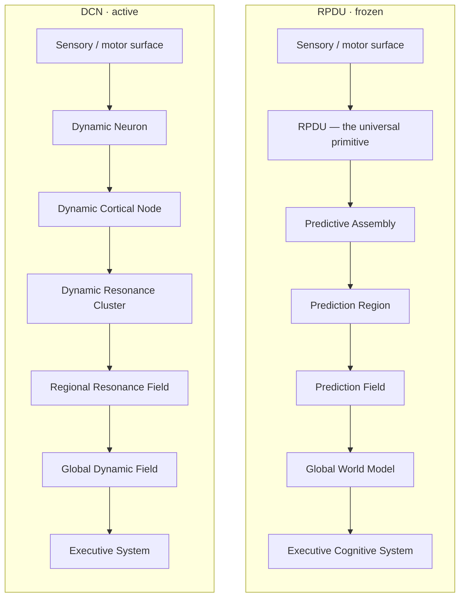

# The architecture, end to end — start here

The single entry point. If you are new to this repository, or returning after a break, read
this first: where the work is, what is built, what is measured, what is proposal, and what
to read next.

**Four entrants, three of them frozen.** Wren, Swift and Heron are closed to change; Corvus is
a blank page. Every one of them is named and summarised in [ARCHITECTURES.md](ARCHITECTURES.md). They share one
benchmark, deliberately, so that any claim about either can be settled on identical code
paths — and so that a future third architecture inherits the whole battery for free.

---

## Where things stand

| | Wren + Swift (RPDU) | Heron (DCN) | **Corvus (OCA v4)** |
|---|---|---|---|
| status | **frozen** | **frozen** | live, unbuilt |
| code | [`architectures/wren`](../architectures/wren/), [`architectures/swift`](../architectures/swift/) | [`architectures/heron`](../architectures/heron/) | [`architectures/corvus/`](../architectures/corvus/) |
| stack spec | [SPEC_SB1.md](wren-swift/SPEC_SB1.md) | [SPEC_DCN_STACK.md](heron/SPEC_DCN_STACK.md) | [SPEC_OCA_ARCHITECTURE.md](corvus/SPEC_OCA_ARCHITECTURE.md) |
| first principles | [FIRST_PRINCIPLES_LEGACY.md](wren-swift/FIRST_PRINCIPLES_LEGACY.md) | [FIRST_PRINCIPLES_DCN.md](heron/FIRST_PRINCIPLES_DCN.md) | [OPEN_QUESTIONS.md](corvus/OPEN_QUESTIONS.md) |
| results | [RESULTS.md](wren-swift/RESULTS.md) | [L1](heron/RESULTS_L1_NEURON.md), [L2](heron/RESULTS_L2_NODE.md) | — |

The evidence all three produced, and that Corvus is written against:
**[WHAT_WE_HAVE_LEARNED.md](WHAT_WE_HAVE_LEARNED.md)**.

How anything gets judged: **[SPEC_CGE.md](SPEC_CGE.md)** — the Cognitive Gates, which
produce engineering decisions rather than scores, and which are versioned independently of the
architecture. Implementation in [`cge/`](../cge/); run `python -m cge.catalogue` for a live audit
of what the suite can and cannot currently decide.

Shared and belonging to neither: [`core/`](../core/) (worlds, sensors, probes, metrics,
baselines), [`cge/`](../cge/) (registry and gates), [`tests/`](../tests/) (129 tests).

**Nothing in `architectures/corvus/` may import from `legacy/`.** A test enforces it, and it also asserts
that `architectures/corvus/` exists — a guard whose target has moved passes vacuously, which is exactly what
happened when `dcn/` was frozen into `legacy/`. The point is that no behaviour is ever an
unattributable hybrid of two hypotheses.

## The one-paragraph state of play

Three complete architectures and six levels of gates in, **no representation this project has
built beats raw pixels at predicting an observable world, and none forms persistent state.** In
the tunnel maze — the one world where the image provably cannot contain the answer — storing the
two coordinates you walked in at beats every architecture here, and the newest scores worse than
storing nothing. All three are now frozen. The open problem, stated so it can be attacked:
**what is the smallest primitive that beats a two-number memory while blind?** That is gate
`P0`; run it with `make p0`.

## How to read a claim in this repository

Three rules, each learned by getting it wrong first.

1. **Every probe reports its control.** A result whose control failed is reported as
   *unmeasured*, never as zero.
2. **Every comparison is at matched capacity and matched budget.** An unmatched probe once
   returned a decode error of 993,925 against a chance of 7.8.
3. **Gates live in `core/` and `cge/`, never inside an architecture.** That is what keeps
   "the same test" meaning the same thing when a level or a version is added.

## The ladder, in both architectures

Both are the same shape — a single repeated primitive, with everything above it emergent
organisation. They differ in what the primitive is and what carries information.



The important difference is not the box names. In RPDU, processing climbs: each level reads
the one below and passes something up. In DCN the physical hierarchy exists but **the
computational hierarchy does not** — at every instant multiple resonance fields interact in
parallel and constrain the dynamics of the levels below. That is the candidate central
claim, and it is not yet testable, because level 2 has to pass first.

## Build order, and why it is strict

Aircraft, not big bang. Each level gets its own battery and its own results file, so a
change that helps one layer and hurts another is visible immediately instead of averaged
into a single score.

```
L1 Dynamic Neuron       built · passes    → SPEC_L1_NEURON.md · RESULTS_L1_NEURON.md
L2 Dynamic Cortical Node built · FAILS 4/5 → SPEC_L2_NODE.md   · RESULTS_L2_NODE.md
L3 Dynamic Resonance Cluster  specified, not started (entry condition unmet)
L4+ Fields, world model, executive, curriculum   proposal only
```

**A level is not started until the level below passes.** Level 3 is specified and
deliberately unbuilt for exactly this reason. That is the methodology working, not failing:
the cost of learning that level 2 does not work was one battery, and nothing is built on top
of it.

## What is established, what is refuted, what is open

**Established** (measured, with controls, reproducible):

- Local backprop-free learning beats a capacity-matched BPTT GRU on this world.
- Gradient flows cannot oscillate; low-pass filters cannot integrate; unbounded accumulators
  drift. Each was provable on paper in minutes and cost a full cycle to find by experiment.
- Send-on-delta emission beats matched-rate controls by 92.9%, and the policy transfers
  across architectures.
- Every level must be scored at the timescale it integrates over: nothing beat "assume no
  change" one tick ahead; at 64 ticks a 44% gain was available.

**Refuted** (claims this project made and then killed with its own measurements):

- *Emergent object permanence.* The mesh stayed at chance on the identity of an object in
  plain view.
- *Coalitions as the substrate of thought.* A synchrony graph scored exactly 1.00x
  persistence as a representation.
- *The predictive code is relational.* Retired at DCN level 2: mean pooling wins at matched
  width on both targets. This was the strongest result the legacy line produced.
- *Phase coordination pays off.* +0.9% with inconsistent sign, at the first level where it
  could be tested.

**Open** — and the one worth attacking:

- **Nothing beats raw pixels.** Until some representation does, on some world, comparing
  architectures is comparing things that are all losing to their own input.
- v2's synchrony coalitions bind objects fourteen times better than anything in the new
  architecture, using a mechanism the new architecture discarded. It should be transplanted
  in isolation and scored.

## Running it

```bash
make venv           # numpy, matplotlib, pytest — no torch, no third-party world engine
make test           # 129 tests
make guards         # legacy stays frozen; corvus/ stays free of legacy imports
make p0             # THE open challenge: beat a two-number memory while blind
make dcn-l1         # Heron level 1 battery
make dcn-l2         # Heron level 2 battery, and Wren vs Swift vs Heron on one target
make cge           # the shared scorecard, 3 seeds, every entrant through every gate
make race           # all four in one maze, then build the demo page
make serve          # watch it at localhost:8080
```

## Reading order

New here: this file → [ARCHITECTURES.md](ARCHITECTURES.md) for who the four entrants are →
[WHAT_WE_HAVE_LEARNED.md](WHAT_WE_HAVE_LEARNED.md) for what they established.

Continuing the work: [docs/corvus/OPEN_QUESTIONS.md](corvus/OPEN_QUESTIONS.md). Two of the five
questions block implementation, and neither should be answered by whoever happens to be writing
the code — which is exactly how both of this project's published corrections happened.
