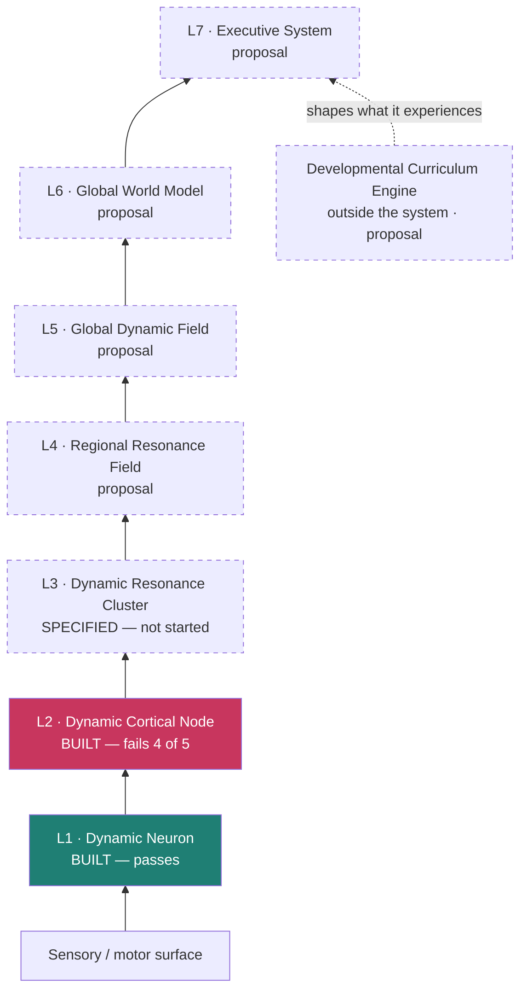

# SPEC DCN — the dynamic stack, full architecture

The high-level map of the active architecture: every level, what it is for, what is built,
and what is proposal. Per-level detail lives in the level specs; this is the document that
says how they fit together and in what order they are allowed to be built.

**Read [SPEC_ARCHITECTURE.md](../SPEC_ARCHITECTURE.md) first** if you have not — it covers
both architectures and the rules that govern claims in this repository.

---

## The change from the previous architecture

The physical hierarchy exists. **The computational hierarchy does not.**

Processing does not climb level by level as in a deep network. At every instant multiple
resonance fields interact in parallel and constrain the dynamics of the levels below.

```
        Global Dynamic Field
                │
        Regional Resonance Fields
                │
        Dynamic Resonance Clusters
                │
        Dynamic Cortical Nodes
                │
        Dynamic Neurons
```

**The candidate central claim: the fundamental unit of computation is neither the neuron nor
the node, but multiscale resonance.** Knowledge lives in the DCNs; intelligence emerges from
dynamic synchronisation between them, modulated simultaneously by local, cluster, regional
and global waves.

That claim is not yet testable. It requires level 2 to pass, and it does not.

## The stack



| level | one-line definition | status | spec |
|---|---|---|---|
| **L1 Dynamic Neuron** | the universal primitive: integrates, oscillates, and speaks only on significant change | **built, passes** | [SPEC_L1_NEURON.md](SPEC_L1_NEURON.md) |
| **L2 Dynamic Cortical Node** | the first cognitive unit — a dynamic hypothesis, publishing only its own state | **built, fails 4/5** | [SPEC_L2_NODE.md](SPEC_L2_NODE.md) |
| **L3 Dynamic Resonance Cluster** | a temporary structure defined by coherence, not position; coordinates, does not compute | specified, not started | [SPEC_L3_CLUSTER.md](SPEC_L3_CLUSTER.md) |
| **L4 Regional Resonance Field** | coordinates an entire cortex — e.g. all of visual | proposal | below |
| **L5 Global Dynamic Field** | whole-system mode: waking, sleep, focus, fatigue, exploration | proposal | below |
| **L6 Global World Model** | not a database — the current synchronised state of every field | proposal | below |
| **L7 Executive System** | goals, attention, curiosity, planning; orchestrates, never understands directly | proposal | below |
| **Curriculum Engine** | outside the system: generates progressively harder worlds | proposal | below |

## The fractal property

Every level obeys the same rules. Only the spatial and temporal scale changes.

```
state → prediction → error → resonance → synchronisation → learning
```

This is what makes one contract (`architectures/heron/contract.py`) and one benchmark sufficient for all of
them, and it is why every level must **declare its horizon**: the same loop at a different
scale is only meaningful if you know which scale you are scoring.

## The wave hierarchy

Not one wave but several, as slow and fast components coexist in an ECG.

| scale | approximate role |
|---|---|
| **Global** (~0.1–4 Hz) | whole-system mode — waking, sleep, focus, fatigue, exploration; the operating system |
| **Regional** | coordinates an entire cortex |
| **Cluster** | synchronises one functional group; appears and disappears quickly |
| **Local** | inside a node, coordinating its neurons |

**Measured caveat.** Axiom 3 says waves coordinate synchronisation and do not store
information. The first half has not paid off: phase gating gave a lone neuron −10% and gave
a node's shared channel +0.9% with an inconsistent sign. The second half is supported — a
synchrony graph carried no content, scoring exactly 1.00x persistence. So phase is
measurably a clock, and having a clock has so far bought nothing. The wave hierarchy above
is proposal resting on a mechanism with no demonstrated payoff.

---

## The levels above the cluster

Deliberately brief. These are one-paragraph definitions with an entry condition, not
specifications — writing detailed specs for level 6 while level 2 fails would be the exact
mistake the build order exists to prevent.

### L4 — Regional Resonance Field

Coordinates a whole cortex rather than one functional group: all of visual, all of motor. A
region is not designed, it is **observed** — specialisation should emerge because the
clusters inside it repeatedly reduce each other's prediction error, and the measurement is
whether that specialisation appears without being asked for.
*Entry condition: L3 passes L3-4 (binding above v2's coalitions).*

### L5 — Global Dynamic Field

The slowest wave, and the closest thing to an operating system: it sets the mode of the
whole system — waking, consolidating, dreaming, exploring, fatigued. It changes *how* every
level below thinks and never *what* any of them knows. The level-2 State Adapter is the
minimal version of this interface, already built and currently measuring no effect.
*Entry condition: L4 shows emergent specialisation.*

### L6 — Global World Model

**There is no world-model database.** The world model is the current synchronised state of
every field — alive, not stored. This is the level at which "what the system believes about
objects, agents, physics and itself" becomes a readable quantity, and the gate is whether it
can be read: decoding object identity, position and persistence from field state, against
the raw-input control that has so far beaten everything.
*Entry condition: some representation in this project beats raw pixels.*

### L7 — Executive System

Small, and deliberately so: attention, goal selection, curiosity, planning, task switching,
energy allocation. It never understands the world directly — it allocates. The five scalars
a node publishes were chosen to be exactly what an executive needs to allocate on, which is
why the level-2 publication bottleneck gate matters more than its position in the ladder
suggests.
*Entry condition: L6 produces a readable world model.*

### Outside the system — the Developmental Curriculum Engine

Not part of the brain; part of its childhood. It generates progressively harder worlds,
measures developmental milestones, chooses what to experience next, controls how long the
system sleeps, adjusts exploration against exploitation, and decides when the cortex is
ready for more. A newborn is not shown calculus on day one.

This is the component most likely to be built early and out of order, because it is the only
one that can be built and tested against the *existing* levels: the worlds in
[`core/world/`](../../core/world/) already form a difficulty ladder (grid → physics with
occlusion → identity → maze → tunnel maze), and choosing among them by measured milestone
rather than by hand is a self-contained, falsifiable piece of work.

## Three operating modes

Inherited from SB-1 and not yet built at any level here. ONLINE interacts and makes tiny
local updates; CONSOLIDATION replays, merges and compresses, producing a *simpler* model;
DREAM generates variations, runs them, and keeps the stable ones. See
[SPEC_SB1.md](../wren-swift/SPEC_SB1.md) for the full description — the cycle is architecture-
neutral and applies unchanged here.

## Build order, and the rule that governs it

```
L1 ✔ passes  →  L2 ✘ fails 4/5  →  L3 blocked  →  L4–L7 not started
```

**A level is not started until the level below passes its gates.** Level 3 is specified and
unbuilt for exactly this reason, and that is the methodology working: the cost of
discovering that level 2 does not work was one battery, and nothing has been built on top of
it. The alternative — building the whole aeroplane and then finding out whether it flies —
is what this project is organised to avoid.

The next three things to try, in order, are named at the end of
[RESULTS_L2_NODE.md](RESULTS_L2_NODE.md).
