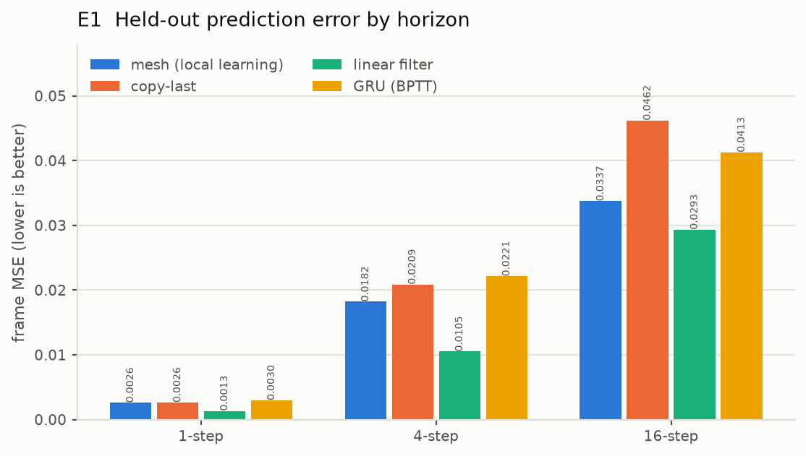
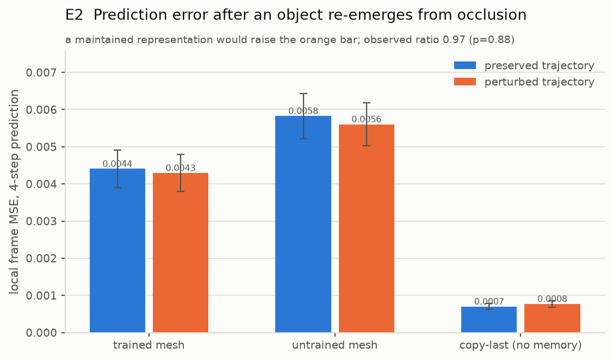
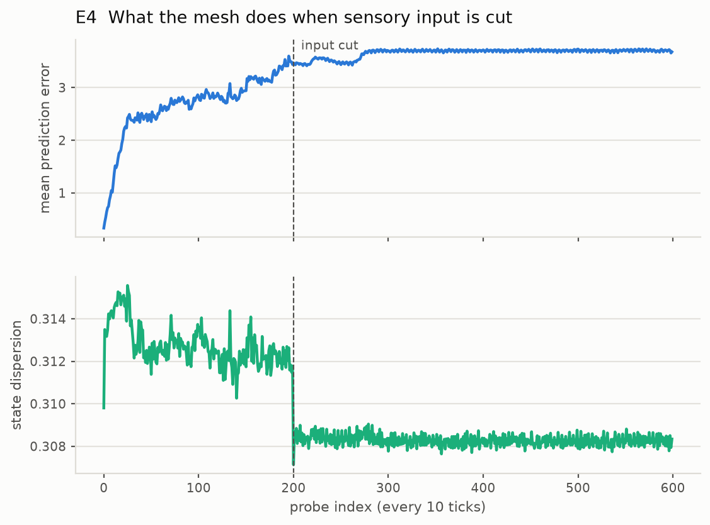
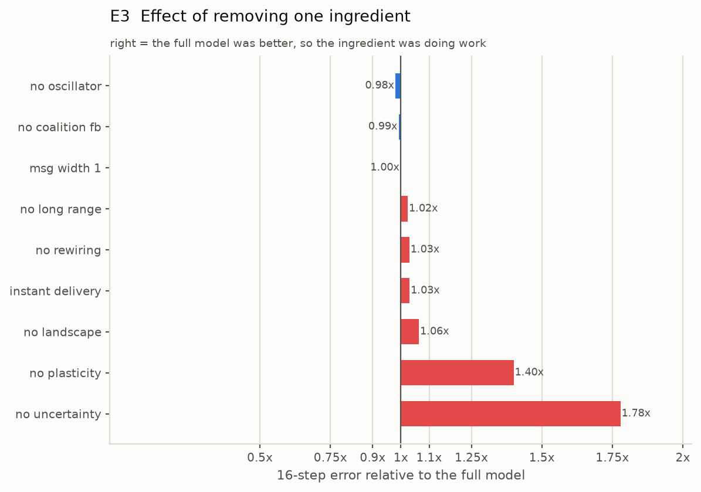

# Results

Four experiments, run on a 576-unit mesh (24x24 torus, 16-dimensional units, 41 in-links
each, ~2.25M parameters) trained for 8,000 ticks on a 2-D world of bouncing shapes and
evaluated with plasticity frozen on a **different world seed**. Everything is seeded and
reproducible with `make repro`.

The headline: **the central learning claim survives; almost everything built on top of it
does not.** A mesh of locally-learning predictive units really does build a useful
forward model of a world it was never told anything about, and beats a BPTT-trained GRU
of matched capacity doing it. But it does not develop object permanence, it does not form
dynamic coalitions, and the communication protocol the architecture document expected to
be as important as the units turns out to contribute almost nothing.

---

## E1 — Does it learn a world model?

Held-out frame MSE, lower is better:

| model | 1-step | 4-step | 16-step | parameters | learning rule |
|---|---|---|---|---|---|
| **mesh** | **0.00260** | **0.01821** | **0.03373** | 2.25M | local only |
| copy-last | 0.00263 | 0.02087 | 0.04621 | 0 | none |
| local linear filter | 0.00133 | 0.01050 | 0.02934 | 99 | closed-form ridge |
| GRU | 0.00286 | 0.02098 | 0.04062 | 1.29M | BPTT |
| GRU, capacity-matched | 0.00296 | 0.02213 | 0.04126 | 2.02M | BPTT |

**The gate passes.** The mesh beats copy-last at every horizon, and the margin widens
with distance: 0.99x at one step, 0.87x at four, 0.73x at sixteen. That shape is the
result worth having. Beating copy-last at one step is nearly free; beating it by 27% at
sixteen steps means the mesh has learned something about how the world evolves, not just
how it currently looks.

It also beats the BPTT-trained GRU at every horizon. That comparison should be read with
care — see the caveats below — but at minimum, purely local learning is not obviously
out of its depth against backpropagation through time on this task.

**It loses to a 99-parameter linear filter**, and that is the most useful number in the
table. A shared 7x7x2 spatiotemporal filter, fit in closed form, beats the mesh at every
horizon (1.95x, 1.73x, 1.15x). This world is mostly translating blobs, and translation is
exactly what a small convolutional linear model represents perfectly. Any claim that the
mesh "learned the physics" has to survive the observation that 99 ridge-regression
coefficients do it better. The one encouraging detail is that the gap closes sharply with
horizon — 1.95x to 1.15x — which is where a genuine dynamical model should have an
advantage over a fixed local filter.

### Caveats on E1

- **The GRU comparison is not a capacity artefact.** The default GRU has 1.29M
  parameters against the mesh's 2.25M, so a wider GRU (288 hidden units, 2.02M
  parameters) was trained to check. It came out slightly *worse* than the smaller one at
  every horizon, so this GRU is limited by optimisation and data rather than by capacity,
  and the mesh's advantage survives matching.
- **Both the mesh and the GRU get a residual output**, predicting the change from the
  current frame rather than the frame itself. Without it, both spend their capacity
  re-encoding 1024 pixels through a bottleneck and lose to copy-last for reasons that
  have nothing to do with world modelling. The linear filter needs no such help.
- **Training-time error understates true error.** The fast learning rule partially fits
  each sample as it arrives, so the training curve is optimistic; this is exactly why
  evaluation freezes plasticity on an unseen world seed.

---

## E2 — Does it maintain a representation of what it cannot see?

An object passes fully behind the occluder. On half the trials its **vertical** velocity
is flipped while it is hidden, so it emerges at the wrong height. Horizontal motion is
untouched, which keeps occlusion duration and emergence timing matched across conditions
(12.5 vs 12.4 ticks) — so any difference cannot be an artefact of perturbed trials simply
being shorter. The measure is the 4-step prediction error near the emergence point, from
a prediction made while the object was still invisible.

| model | preserved | perturbed | ratio | p |
|---|---|---|---|---|
| trained mesh | 0.00441 | 0.00429 | 0.97 | 0.88 |
| untrained mesh | 0.00583 | 0.00560 | 0.96 | 0.79 |
| copy-last (no memory) | 0.00070 | 0.00077 | 1.10 | 0.56 |

**Clean null, across 284 scored occlusion events.** A mesh that maintained a
representation of the hidden object would be *more* surprised when that object violated
its expectation; the observed ratio is 0.97, in the wrong direction and nowhere near
significance. Decisively, the **trained mesh (0.97) is indistinguishable from the
untrained one (0.96)** — whatever tiny asymmetry exists is architectural noise, not
something learning produced.

The controls behave as they should, which is what makes the null trustworthy rather than
merely uninformative: copy-last, which has no state whatsoever, shows no asymmetry
either, so the measure is not manufacturing effects.

The honest conclusion is that **object permanence did not emerge**. The architecture
document's headline experiment — "nobody programmed object permanence, the network
invented it because it minimises prediction error" — is not supported here.

---

## E4 — What does it do in silence?

Sensory input is cut and the mesh free-runs for 4,000 ticks.

| metric | driven | silent |
|---|---|---|
| state entropy | 3.259 | 3.275 |
| state dispersion | 0.312 | 0.308 |
| mean surprise | 3.05 | 3.70 |
| units in a coalition | 1.7% | 1.8% |
| coalition churn | 0.021 | 0.015 |

**The mesh neither collapses nor diverges.** State entropy and dispersion are essentially
unchanged, and the safety clip never binds. For a network of gradient-flow units this was
not guaranteed — the obvious failure mode is every unit sliding into its nearest valley
and stopping — so the design document's "the brain keeps changing even in silence" holds
in the weak sense that the dynamics stay alive and bounded.

It does not hold in the strong sense. Coalition membership barely turns over (churn
drops from 0.021 to 0.015), so the mesh persists rather than reorganises. Surprise rises
by 21%, as it should: the mesh keeps predicting a world that is no longer there.

### Coalitions essentially do not form — and this is not a threshold artefact

Only **1.7% of units** belong to any coalition, in both the driven and silent phases.
Before treating that as a finding I checked whether the a-priori threshold (coherence
> 0.6) was simply set too high. It was not, in the way that matters: the coherence
distribution over linked pairs has median 0.00, 90th percentile 0.20, and 99th percentile
0.38. Units genuinely do not co-vary. Lowering the threshold would relabel the noise
floor as coalitions rather than reveal hidden structure.

The detector itself works: [a test](../../tests/test_wren_protocol.py) plants two groups of
correlated units and confirms it recovers exactly those groups, and a second test
confirms it reports nothing on pure noise. So the null is about the mesh, not the
measurement.

This is the sharpest negative result in the project. "Thousands of temporary coalitions
form and dissolve, and thought is the settling of the network" is the most evocative idea
in the design document, and in this implementation nothing of the kind happens.

---

## E3 — Which ingredients actually carry the effect?

Each row removes exactly one claim and reruns E1 (2 seeds, held-out world). Ratios are
16-step error relative to the full model, so above 1 means the ingredient was doing work.

| ablation | 1-step | 4-step | 16-step | reading |
|---|---|---|---|---|
| no uncertainty head | 1.11x | 1.23x | **1.78x** | the one ingredient that clearly matters |
| no plasticity | 1.50x | 1.21x | **1.40x** | sanity check: learning is real |
| no landscape | 0.99x | 0.99x | 1.06x | marginal |
| instant delivery | 1.00x | 1.01x | 1.03x | marginal |
| no rewiring | 1.01x | 1.01x | 1.03x | marginal |
| no long-range links | 1.00x | 1.00x | 1.02x | marginal |
| message width 4 → 1 | 1.00x | 1.00x | 1.00x | no effect |
| no coalition feedback | 1.00x | 1.00x | 0.99x | no effect |
| no oscillator | 1.00x | 0.99x | 0.98x | no effect, slightly helps |

**Every ablation lands within 3%.** Cutting messages from four scalars to one changes
nothing. Removing long-range links, structural rewiring, the coalition feedback loop and
the shared oscillator each move 16-step error by 3% or less, and two of them are
improvements. The one-tick propagation delay that the whole settling story depends on is
worth 3%.

> **Correction (see [the Stage 1 follow-up](#appendix--why-these-nulls-are-weaker-evidence-than-they-look)).**
> An earlier version of this section read that table as "the Predictive Mesh Protocol is
> inert", contradicting the architecture document's closing argument that the protocol
> would matter as much as the units. That claim was too strong. In this world a
> 7x7x2 linear filter is very nearly Bayes-optimal, so *no* model can get far above it
> and no component of any model can show value either — the experiment had no power to
> detect whether the protocol matters. The defensible statement is the narrow one: **on a
> task with no headroom above a linear filter, these ablations are uninformative.**

The energy landscape is nearly inert too: replacing it with a generic bounded recurrent
map of identical capacity costs 6% at the longest horizon and nothing at all at short
ones. The geometry is real — it is a genuine gradient flow with bistable valleys and
hysteresis, and [tests](../../tests/test_wren_landscape.py) prove that — but on this task it earns
very little over an ordinary recurrent update.

**What does matter is the uncertainty head**, by a wide margin. A unit predicting the
size of its own error, and using that prediction to weight its own learning, is worth
more than every protocol feature combined.

### E3b — but is the uncertainty head just a learning rate?

Precision `c = 1/(1+sigma_hat)` multiplies every learning rate. Switching the head off
sets it to 1.0, which also raises the effective step size several-fold — so the 1.78x
could be nothing more than a detuned learning rate. `exp03b` sweeps the learning rate for
the ablated model to separate the two.

| ablated model, learning rate scaled | 1-step | 4-step | 16-step |
|---|---|---|---|
| full model (for reference) | 0.00260 | 0.01822 | **0.03379** |
| x0.15 | 0.00262 | 0.01876 | 0.03483 |
| **x0.3** | 0.00259 | 0.01841 | **0.03409** |
| x0.5 | 0.00263 | 0.01903 | 0.03762 |
| x1.0 (this is E3's `no_uncertainty`) | 0.00288 | 0.02243 | 0.06009 |
| x2.0 | 0.00343 | 0.03287 | diverged |

**The uncertainty head is a learning-rate schedule.** At scale 0.3 the ablated model
lands within 1% of the full model (0.03409 vs 0.03379). Nothing about *predicting your
own error*, per unit and over time, is doing work here that a single well-chosen constant
does not do — so E3's headline should be read as "the learning rate matters", not as
support for the design document's claim about a unit modelling its own uncertainty.

One real benefit survives: at scale 2.0 the ablated model **diverges outright**, while
the full model is stable at the same nominal rate. Precision weighting widens the range
of learning rates that do not blow up. That is a useful engineering property, and it is
not the cognitive claim the design document was making.

---

## What this says about the hypothesis

Taking the four experiments together:

**Supported.** A network of local predictive dynamical units, learning only from its own
prediction errors with no backpropagation anywhere, builds a forward model good enough to
beat both a naive baseline and a BPTT-trained recurrent network of matched capacity, with
its advantage growing at longer horizons. That is not nothing: local learning is usually
assumed to be badly outclassed, and here it is not. The energy-landscape formulation is
also a genuine gradient flow with bistable valleys and hysteresis rather than a metaphor.

**Not supported.** Everything else. Object permanence did not emerge (E2, clean null
across 284 events, trained mesh indistinguishable from untrained). Coalitions did not
form (E4, 1.7% of units, with a detector demonstrably able to find planted ones). Every
protocol ablation landed within 3% (E3), and the single ingredient that looked
load-bearing dissolved under its own control into a learning-rate constant (E3b).

What survives is much smaller than the hypothesis: **a local predictive learner with a
well-tuned step size.** In this world, the recursion, the protocol, the synchronisation
and the self-modelled uncertainty are all ornament.

*How much of that generalises beyond this world is the subject of the appendix below —
for two of the four nulls, considerably less than it first appeared.*

**The most uncomfortable comparison** is none of the above: 99 ridge-regression
coefficients beat 2.25 million parameters of predictive dynamical machinery at every
horizon. The right response is not to discard the architecture but to change the world.
This one is too easy — translating blobs are exactly what a small linear filter
represents perfectly, so this world cannot distinguish a world model from a motion
filter, and it gives coalitions nothing to form *about*. A fair test needs a world where
local linear extrapolation genuinely fails: occlusions long enough to require memory
rather than extrapolation, objects that deform or interact non-linearly, or dynamics with
several discrete regimes where the landscape's bistability would finally earn its place.

Two of these nulls are also plausibly scale results rather than architecture results: 576
units and 8,000 ticks is the low end of the architecture document's own 100–1000 range,
and the mesh converges within roughly 2,000 ticks and then plateaus. Before concluding
that coalitions cannot form, it is worth running the same code with a harder world and
more units — which is precisely what this repository is set up to do.

---

# Appendix — why these nulls are weaker evidence than they look

Four follow-up diagnostics were run to find out *why* the nulls happened. They change the
diagnosis substantially, and one of them retracts the E3 claim above.

## The mesh has no object representation at all

A ridge probe decoding object position from the mesh state, against decoding from the
raw retina the mesh had just been fed. One object, so a linear probe can solve the
assignment; held out in time; errors in world units on a 64-wide image:

| probe input | object visible | object fully occluded | chance |
|---|---|---|---|
| raw retina (control) | **7.45** | 14.14 | 22.33 |
| mesh state | **16.31** | 14.71 | 22.33 |

The mesh state is a *worse* position code than its own input, and during occlusion it
carries nothing beyond what the static frame already implies. E2 was not measuring a
failure to maintain a representation through occlusion — there was never an object-level
representation to maintain, even in full view. The behavioural null was a symptom.

## Gradient flow makes coalitions impossible, provably

Coalitions are synchronisation, and synchronisation is a property of oscillators. A
gradient flow has `dE/dt = -‖∇E‖² ≤ 0`, so it has no periodic orbits — it falls into a
valley and stops. Measured: with drive frozen a unit's step size decays by a factor of
4.2e-4 and halts; across the running mesh 74% of state power sits at periods longer than
50 ticks, with nothing at the 40-tick oscillator period. Two fixed points cannot
synchronise — a near-constant trace has no variance to correlate — which is exactly the
measured coherence (median 0.00, p90 0.16).

This is an internal contradiction in the design document. "Internal Geometry" says a
rolling ball always falls into one valley; Step 7 says synchronisation is computation.
Those are incompatible, and v1 implemented the first faithfully and thereby forbade the
second.

## The world had no headroom, which is why E3 proved little

World v1 is rigid shapes translating at constant velocity, and a 7x7x2 linear filter
represents translation of anything smaller than its window exactly. When the optimal
predictor is nearly linear, no architecture can get far above it and no *component* of
one can show value — which is precisely what E3 measured. Hence the correction above.

## The assumption underneath all of it

> **Local prediction error is sufficient to force global structure.**

It is not, because in world v1 local prediction is *locally satisfiable*: each patch's
future is almost entirely determined by that patch's own recent past. The optimal local
solution is local, and the mesh correctly finds it. Nothing ever needs an object, so no
object code forms; with no object code there is nothing to bind, so no coalitions; with
nothing to bind there is no work for the protocol, so ablating it costs nothing. One
assumption explains all four nulls.

## World v2, and what it changes

A second world (`rpdu/world/physics.py`) was built to remove the ceiling: gravity with
elastic bounces, discrete gravity regimes cued by the border, per-object identity, and a
full-height occluder band that hides objects for a median of 22 ticks — longer than the
longest prediction horizon — with a bounce happening out of sight on ~50% of episodes.

The validation gate (`exp05_world_validation.py`) asks whether the world rewards memory,
model-free, from ground truth: how much of an object's re-emergence position is
determined by the state it had when it vanished?

| quantity | error | chance | determined |
|---|---|---|---|
| exit height (y) | **4.68** | 20.44 | **77%** |
| exit x | 9.40 | 9.69 | 3% (pinned by the band edge, as expected) |

**77% of re-emergence height is there to be predicted, over 8,941 episodes** — against
the best pixel baseline capturing 5% of it. That gap is the target: unlike world v1,
this world can tell a world model apart from a motion filter.

The v1 mesh behaves the same way on the new world: probe error 7.74 against the retina's
4.85 when visible, and −5% during occlusion. As predicted, changing the world alone does
not produce an object representation.

## A prediction that was wrong, and what it taught

Before running it, I predicted at ~65% confidence that moving to world v2 would make the
protocol ablations start to matter — that if the world had been the problem, `msg_width
4→1` and `no_long_range` would begin to cost something even with the unchanged v1 mesh.
Re-running E3 on world v2 (`--world physics`):

| ablation | t1 | t4 | t16 |
|---|---|---|---|
| no plasticity | 2.24x | 1.47x | 1.29x |
| no uncertainty | 1.00x | 0.98x | 1.11x |
| no landscape | 1.06x | 1.10x | 1.05x |
| no rewiring / no long-range | 1.01x | 1.00x | 1.03x |
| msg width 1 / instant delivery / no coalition fb / no oscillator | 1.00x | 1.00x | 1.00–1.01x |

**The prediction failed.** Everything except plasticity is still within 3%.

One wrinkle had to be cleared first: the v1 learning rate (0.08) is badly mis-tuned for
this world, where objects move up to 2.2 px/tick and the 16-step target is nearly
unpredictable from local information. At 0.08 the mesh is *14x worse than copy-last* at
16 steps and switching learning off entirely improves it 11-fold — the fast rule with no
shrinkage toward the baseline overfits an unpredictable target rather than falling back
on it. The table above is at 0.01, where the mesh beats copy-last at all three horizons.

The reason the prediction failed is visible in G0a: whole-frame MSE on world v2 is *also*
nearly linear-optimal (a non-linear local filter beats a linear one by −0.2% at 16
steps), because most pixels most of the time are still locally linear. Whole-frame MSE
simply cannot see the structure this world added — all of that lives in the 22-tick
occlusion episodes, which are a vanishing share of the pixel budget.

So the lesson is sharper than "change the world": **the metric was as much the problem as
the world.** Re-emergence error is the measurement with 77% headroom; whole-frame MSE has
none on either world, and every conclusion drawn from it — including all of E3 — was
always going to be uninformative. Stage 2 scores re-emergence events.

---

# Stage 2 — architecture v2, increment 1

`rpdu2/` replaces the unit's dynamics rather than tuning it. Each unit is now a bank of
Stuart-Landau oscillators (`z' = -w*y + (mu - r^2)*x + drive` per rotor), so it settles
onto a *limit cycle* instead of a fixed point. Content is read out as rotor **amplitude**
(phase-invariant) while **phase** does the binding — the standard division of labour in
the oscillatory-binding literature, and necessary here: reading raw rotor coordinates
made position decoding twice as bad, because the same represented value produces
different coordinates depending on when you look. Messages are gated on phase agreement,
integration timescales are spread log-uniformly across units, and sensory input is
randomly masked while still being scored, so a unit must reconstruct its own patch from
its neighbours.

This also folds in the two ideas from `RPDU_extended_design.md` that survive contact with
the diagnostics. Hawkins' *location signal* — a column representing features at positions
in an object's frame, built through movement — requires state that persists and advances,
which is the same fix the gradient-flow diagnosis demanded from the other direction. And
his *voting* is what gives coalitions a job; that lands in increment 2.

## Increment-1 gate (12,000 ticks, 3 objects, same stream for both)

| | v1 mesh | v2 mesh |
|---|---|---|
| position decode, visible (world units) | 51.06 | **23.44** |
| position decode, occluded | 43.03 | **18.38** |
| ...against raw retina | 19.54 | 19.54 |
| units in a coalition | 0.1% | **55.6%** |
| largest coalition | 0 | 16 of 144 |
| coalition/object MI, excess over shuffled null | +0.000 | −0.000 |
| re-emergence error, 16-step | **0.0082** | 0.0307 |

**What worked.** Coalitions now exist: 55.6% of units against v1's 0.1%, in moderate
groups of ~16 rather than one global blob. Given that v1's gradient flow made
synchronisation *provably* impossible, this is the mechanism being restored rather than a
tuning win. The state is also a far better object code — position decodes at 23.4 world
units where v1 manages 51.1, which is worse than chance. And v2 finally carries slightly
more about a hidden object than the static frame does (+5.9%, against v1's −120%).

**What did not.** The +5.9% is well short of the 15% bar for "tracks what it cannot
see". Coalitions form but carry **no object information**: MI excess over a shuffled null
is zero. And v2 predicts *worse* than v1 at re-emergence (0.031 vs 0.008).

So increment 1 restored the mechanism and not the function. Coalitions can now exist;
they are not yet about anything.

## Two measurement bugs worth recording

Both would have produced impressive-looking false positives.

**Phase-locking value measures the wrong thing here.** PLV rewards a phase difference
that is merely *constant*, so two units whose random natural frequencies happen to match
score 1.0 while sitting permanently in antiphase. Symptom: changing coupling strength
tenfold left the PLV distribution *identical* — the coalitions were an artefact of the
frequency draw, not of any interaction. Replaced with mean cos(dphi), which is high only
under genuine alignment.

**Normalised MI is badly biased on small samples.** Assigning each object to the single
retinal tile containing it left 2–3 labelled units per frame, and MI over 2 points is
noise. The first version of this table reported v1 coalition/object MI of 0.449 — which
looked like a real effect until the shuffled-label null came out at 0.449 too. Every MI
number here is now reported as excess over that null, and both architectures score zero.

# Stage 2 — increment 2: voting

Increment 1 restored the *mechanism* for coalitions and not the *function*. Increment 2
adds the Thousand Brains answer: a **vote** — a hypothesis each unit holds, reconciles
with a confidence- and phase-weighted average of its neighbours', and, crucially, feeds
into its own prediction heads, so agreeing with the right neighbours is worth something.
Frequency is also modulated by each unit's novelty, so phase advances faster where the
world changes faster and becomes a running integral of local motion.

Where the location signal *cannot* come from is worth recording: the readout is rotor
amplitude and rotation preserves amplitude, so prediction error has essentially no
gradient with respect to frequency ([test](../../tests/test_swift_voting.py) pins the residue and
shows it shrinking with step size, i.e. it is an integration artefact). Phase can be
shaped by coupling and by input, never by the heads.

## Result: coalitions still carry no object information

12,000 ticks, 3 objects, same stream, both coalition definitions scored against a paired
shuffled-label null:

| | phase coalitions | vote coalitions |
|---|---|---|
| v1 | −0.000 ± 0.000 | — |
| v2 | +0.004 ± 0.004 | +0.004 ± 0.005 |

Both are within noise of chance (n = 135 snapshots). Voting produces well-differentiated
groups — median vote similarity near 0, largest coalition ~13 of 144 — they simply are
not *about objects*. The probe also regressed slightly, since 8 uninformative vote
dimensions dilute the readout the position probe reads.

**Voting did not produce binding.** That is the honest headline.

## Why, and what it implies

Two failure modes were found and fixed along the way, and the second one explains the
result.

**Agreement alone has exactly one attractor.** With consensus pressure and no task
pressure, the entire population converges on a single vote — measured median similarity
0.999, one coalition of all 144 units. Fixed by training the proposal map on *both* the
neighbourhood consensus and the gradient the prediction heads want, plus sharpening votes
toward discrete hypotheses. A [test](../../tests/test_swift_voting.py) now pins the collapse so it
cannot come back silently.

**But the task pressure does not require binding.** A unit predicts its own patch and its
own incoming messages. Both are satisfiable from local content and spatial adjacency
without ever knowing *which object* a patch belongs to — even under masking, since
inpainting from spatially adjacent neighbours needs proximity, not identity. This is
v1's root cause reappearing one level up: **the objective is locally satisfiable, so
nothing selects for object-level structure.** The only part of this world that genuinely
requires binding is occlusion re-emergence, and those events are far too rare to
influence an error signal dominated by ordinary frames.

That points at a specific next step rather than another mechanism. But see increment 3:
my planned fix — up-weight rare surprising events — turned out to be the wrong idea, and
`RPDU_Assesstment.md` said so before the experiment did.

---

# Stage 2 — increment 3: making objects *necessary*

The assessment's correction: weighting occlusions more heavily cannot work, because even
at a hundred times the weight, local trajectory extrapolation still solves them. Rarity
was never the problem. The right question is **what prediction is literally impossible
without object identity** — and then to build exactly that.

`rpdu/world/identity.py` does. Two visually distinct kinds of object: a **passer** crosses
the occluder band and exits the far side; a **bouncer** reverses inside and comes back out
the side it entered. Brightness gives the kind away in the open and nothing gives it away
while hidden, and at the moment of disappearance the two are moving identically. So the
exit side is fixed entirely by *which object went in*. There is no motion-field solution
by construction.

The measure is a decode of the hidden object's kind, as balanced accuracy (chance 50%,
needed because bouncers re-enter repeatedly and skew the raw base rate to 69%).

| | state, object visible | state, object HIDDEN |
|---|---|---|
| v1 mesh | 51.5% | 52.1% |
| v2 mesh | 61.2% | 51.9% |
| raw retina (control) | **75.9%** | **50.3%** |

Both controls behave: the retina reads the cue easily when the object is in the open and
sits at exactly chance while it is hidden, so the cue is real and nothing leaks through
the band.

**The mesh does not build the object representation even when the task makes one
necessary.** And the failure is more basic than memory: v1 is at chance on the kind of an
object *in plain view* (51.5% against the retina's 75.9%), and v2 only partly better. The
bottleneck is upstream of binding — the state does not retain object appearance at all,
so there is nothing to carry through an occlusion in the first place.

That is the answer to the assessment's challenge ("if RPDU still refuses to build objects
when they are computationally necessary, I'd seriously question the architecture"). It
refuses. The probe design took two iterations to become trustworthy: a whole-frame probe
cannot tell which of four objects it is being asked about, and with a fixed balanced set
it can name the hidden one by elimination from the three still visible. Both are fixed by
probing a patch local to the object.

---

# Stage 2 — increment 4: the maze, and the first positive result

Every world so far was passive. The assessment's strongest hypothesis is that the missing
ingredient is an active loop — choose, predict, compare, update — and that object identity
is learned through action. `rpdu/world/maze.py` is the cheapest honest version: a braided
maze, an agent that moves under a fixed exploration policy and receives an efference copy
of its own action, and a 5x5 window, so most of the maze is out of sight at any moment.

Spatial memory is not merely rewarded here, it is required. The probe decodes a 7x7 wall
map and splits the cells by whether they are currently visible:

| | inner 5x5 (in view) | outer ring (NOT in view) |
|---|---|---|
| raw retina (control) | 100.0% | 77.3% |
| **v1 mesh** | 100.0% | **84.1%** |
| v2 mesh | 90.8% | 71.6% |

**The v1 mesh beats the retina by 6.8 points on cells it cannot see.** This is the first
time in the entire project that a probe has found the mesh carrying anything beyond its
instantaneous input — it holds a fragment of map. It is a modest effect and the control is
a demanding one (a local view largely identifies *where you are* in a fixed maze, which is
why the retina reaches 77%), but the sign is finally right, and it points where the
assessment said it would: at the sensorimotor loop rather than at another mechanism.

Two further notes. The oscillator architecture is *worse* here than v1 (71.6%), continuing
its pattern of restoring mechanisms while costing accuracy. And braiding the maze was
required: a DFS-carved maze puts walls on strictly even coordinates, so a raw-pixel probe
scored 94% on cells it could not see by deducing them from parity — the third measurement
artefact this project has caught by insisting on a control.

**Navigation.** Steering by the mesh's own accumulated wall map — the mesh supplies the
map, breadth-first search picks the step, the agent is told only the *direction* of the
exit — reaches the exit **38 times in 900 steps**, against roughly 6 for the same agent
wandering randomly. A greedy planner was tried first and reached it zero times, walking
into dead ends and oscillating; the map was fine, the planner was not.

There is [a live replay](https://claude.ai/code/artifact/3169b8c6-35d9-4d16-84ac-bc0adab0c810)
showing the maze and the mesh's belief side by side as it goes.

> **Correction — the maze result does not survive scale.** That +6.8 was a single seed at
> one lattice size. Run across three seeds and two sizes through the new benchmark
> (`python -m cge.run --gates maze --seeds 0 1 2 --sides 12 24`):
>
> | | side 12 | side 24 |
> |---|---|---|
> | v1 | **+0.044 ± 0.006** | **−0.130 ± 0.014** |
> | v2 | −0.026 ± 0.005 | −0.040 ± 0.005 |
>
> The effect holds at side 12 and **reverses at side 24**, where the mesh is 13 points
> *worse* than raw pixels. I had put this at ~60% to survive; it did not. The one positive
> representational result in this project was a small-lattice artefact, and the honest
> statement is that no mesh version yet beats pixels at holding what it cannot see.

---

# Stage 3 — the Predictive Assembly

[SPEC_PA.md](SPEC_PA.md) defines the level above the RPDU: 32–128 units with a local
synchroniser, a **shared dynamic workspace** in which the object is supposed to emerge
rather than inside any member, a coalition manager, and an executive interface exporting
only five scalars. Its central claim is that memory, prediction and identity are
*collective* properties.

It is built as a **read-only layer over an unmodified v2** (`rpdu_pa/`). That was a
deliberate choice rather than a shortcut: if it works, the mesh only ever lacked an
aggregator; if it fails specifically for want of top-down influence, that failure is what
justifies a v3 rather than an assumption made in advance.

## The tunnel maze — the cleanest control this project has produced

Tested on covered corridors, where the agent moves normally and receives its efference
copy but every frame it sees is **byte-identical** ([test](../../tests/test_swift_assembly.py)). That
matters more than the extra difficulty: in the open maze a 5×5 view largely identifies
*where you are*, so the pixel control sat at 77% and the headroom was thin. Inside a
tunnel pixels carry no positional information at all, so the control is at chance **by
construction** — measured 7.79 against a chance of 7.79.

What remains is dead reckoning, bracketed by three references: **frozen at the tunnel
mouth** (the bar — remember only where you went in), the pixel control (chance), and a
perfect dead-reckoner (zero).

| position error while blind (maze cells) | |
|---|---|
| frozen at tunnel mouth | **2.07** |
| full mesh state | 4.78 |
| raw retina = chance | 7.79 |
| members, mean-pooled | 12.02 |
| assembly workspace | 17.6–33.5 |

**Neither mesh does path integration**, and the assembly does not rescue it.

## PA1 fails, and the reason is worth more than the gate

The pre-registered kill criterion was: if the workspace never beats mean-pooled members,
"the object emerges in the shared field" is unsupported. It never did, at any setting.

But the interesting part is *where* the information dies. Decoding position from the same
units, at matched probe capacity:

| representation | dim | position error |
|---|---|---|
| full mesh, all 144 units | 3456 | **4.65** |
| one assembly, units kept apart | 864 | **6.41** |
| one assembly, mean-pooled | 24 | **44.36** |
| workspace | 128 | 33.50 |
| chance | | 7.75 |

**Averaging is what destroys it.** The same 36 units carry position at 6.41 when kept
apart and 44.36 once meaned — worse than chance. The workspace is downstream of that pool,
so no amount of temporal machinery below it can recover what the pool discarded.

So the assembly is not failing because a shared field is the wrong idea. It is failing
because **the way members contribute to the field throws the answer away before the field
ever sees it.** That is a specific, fixable defect in the spec's aggregation step, and it
sits entirely inside the PA layer — no mesh change, so v2 still stands.

## Two dynamics mistakes found on the way, both of the same family as v1's

The workspace went through three broken designs, and each was broken *provably* rather
than empirically — the same failure mode as v1's gradient flow, where a dynamics was
chosen without checking it could express the target function.

1. **`w ← (1−α)w + α·c` cannot integrate.** It ties retention to 1−α = 0.96 and is a
   first-order low-pass whose fixed point is the *mean* of its input. On a 1-D walk the
   best linear readout gives position error 6.17 against a chance of 6.14; at retention
   1.0 it gives 0.00, because that is an accumulator. Retention is now decoupled from α
   and spread log-uniformly across time constants of 10–2000 ticks.
2. **An accumulator with a DC input ramps forever.** Fixed by subtracting a slow running
   mean before integrating — high-pass, then integrate, which is what biological path
   integrators need for the same reason.
3. **The coalition manager could never fire**, because it compared the assembly's
   prediction error against the mesh's `surprise`, which is on an entirely different
   scale (0.005 against order 1). Now measured against a persistence baseline in matched
   units.

## A measurement bug that invalidated three tables before it was caught

Every probe in this project now goes through one implementation ([core/probes.py](../../core/probes.py)),
because the ad-hoc ones were wrong in two ways that both produced *plausible-looking*
numbers:

- **Unstandardised ridge.** The penalty scales with `trace(X'X)/d`, so with per-dimension
  standard deviations spanning six orders of magnitude the large directions absorb it all
  and the small ones are unregularised. This returned position errors **above chance** —
  a fit worse than predicting the mean.
- **Unmatched capacity.** Decoding from a 3456-dimensional mesh state and a 96-dimensional
  pooled vector on the same 1600 frames compares width, not information. Without
  projecting both to the same number of components the mesh scored an error of 993,925.
- And PCA has to be taken on *centred* data, never on per-dimension-whitened data, or
  whitening inflates every near-constant direction to unit variance and the SVD ranks
  numerical noise as signal.

All three are now pinned by tests.

## Was the maze simply too hard for a first assembly?

A fair question, since SPEC_PA's own ladder starts at "a moving dot" and I had jumped to
"an agent with goals in a maze with tunnels". Tested directly, position decode at matched
capacity:

| rung | workspace | pooled | mesh | chance |
|---|---|---|---|---|
| 1. a moving dot | 49.3 | 15.2 | **8.8** | 21.5 |
| 2. two interacting objects | 115.2 | 18.4 | 14.4 | 20.0 |
| 3. occlusion | 79.2 | 19.0 | 14.5 | 20.0 |

PA1 fails at every rung, including the simplest one there is. **Difficulty was not the
explanation.**

## Three defects found by asking what the layer could possibly have learned

The workspace scoring *worse than chance* is not a weak result, it is an impossible one,
and chasing it produced the useful part of this section.

**The representation drifted.** Splitting the same data by time gave 53.1 and at random
gave 12.4, against a chance of 21.5 — drift of 0.55 sd between halves versus pooled's
0.07. (The random split leaks through adjacent frames, so 12.4 is a *diagnostic*, not a
performance claim: it separates "the information is absent" from "the representation is
unstable", and said unstable.) Fixed with bounded integration and a gain-controlled
readout.

**The prediction target was unwinnable.** Member state barely moves tick to tick, so
"assume no change" is an excellent prediction. The assembly, asked for an absolute
prediction, plateaued at 7–19x *worse* than persistence and never improved for an entire
run. A residual head — the same fix the mesh already uses — brought it to 1.06x.

**The horizon was wrong, and this one is a principle rather than a bug.** Fitting the
assembly's own objective offline, from the entire mesh state, best case:

| horizon | best possible fit, relative to persistence |
|---|---|
| 1 | 1.32x |
| 4 | 1.32x |
| 16 | 1.09x |
| **64** | **0.56x** |
| 128 | 0.91x |

At the horizons I was scoring, **there was nothing for any implementation to win** — no
function of the mesh state beats persistence one tick ahead. At 64 ticks a 44% gain is
available. A layer that integrates over hundreds of ticks has no business being scored on
the next frame, and the recursive hierarchy in SPEC_PA implies this without saying it:
each level should predict at the scale it integrates over.

## Where it still fails, and what that says about the spec

With the horizon corrected, the signal exists — and the field still does not carry it:

| predicting members 64 ticks ahead | relative to persistence |
|---|---|
| full mesh state | **0.69x** |
| assembly workspace | 6.56x |

The information is in the mesh. It is not in the field built from the mesh. Trying both
aggregations the spec's wording allows — a mean over members, and a learned projection
that keeps them apart — neither rescues it.

So across four rungs of difficulty, two aggregation schemes, three repaired defects and a
corrected horizon, the finding is stable and it is specific: **the assembly's compression
of its members into a shared field destroys what its members carry.** That is a claim
about SPEC_PA's aggregation step, not about the idea of a shared field, and not about the
RPDU below it.

The pre-registered kill criterion said that if the workspace never beats mean pooling,
"the object emerges in the shared field" is unsupported. It never did. I would add one
qualification the evidence now supports: the field was never given a chance to hold
anything, because for most of this work it was being scored on a target that contained no
signal at all.

## Isolating the aggregation operator — the information was never missing

The failure above was unusually clean: the information exists in the mesh (0.69x) and is
gone from the assembly (6.56x), which points at the compression operator and nothing else.
So `exp11_aggregation.py` holds the mesh, the members, the target and the protocol fixed
and varies *only* how member states become an assembly state — measured offline at best
case, which separates "does this representation contain the signal" from "can a local rule
find it".

Predicting members 64 ticks ahead relative to persistence, 3 seeds, matched capacity,
ridge strength chosen on a validation split (lower is better; 1.00 means no better than
assuming nothing changes):

| representation | 1 object | 2 objects | 2 obj + occluder |
|---|---|---|---|
| full mesh (linear ceiling) | 0.60 ± 0.20 | 0.84 ± 0.04 | 0.92 ± 0.03 |
| **pairwise co-activation** | 0.73 ± 0.23 | **0.81 ± 0.03** | **0.79 ± 0.01** |
| members, no compression | 0.62 ± 0.17 | 0.86 ± 0.09 | 0.90 ± 0.04 |
| synchrony graph | 0.85 ± 0.20 | 1.00 ± 0.00 | 1.00 ± 0.00 |
| autonomous reservoir | 0.92 ± 0.15 | 0.95 ± 0.05 | 0.94 ± 0.08 |
| attention-weighted mean | 3.14 ± 2.97 | 0.99 ± 0.00 | 1.00 ± 0.01 |
| mean vector (the baseline) | 37.6 ± 51.7 | 0.99 ± 0.00 | 0.99 ± 0.00 |

**A mean never predicts.** It sits exactly at persistence wherever it is numerically
stable, and is wild where it is not. Weighting it by confidence changes nothing.

**Pairwise co-activation is the only operator that improves as the world gets harder**,
and from two objects onward it beats the full mesh state. It can beat that "ceiling"
because the ceiling was a *linear* one: a linear readout cannot form products of member
activities, so handing it those products exposes structure that was in the mesh all along
but was not linearly readable. The advantage tracks the number of things there are to
relate — worse than the ceiling with one object, better with two, much better with two
and an occluder — which is what a relational code should do.

So the conclusion is sharper than "pooling is lossy": **the predictive code is quadratic
in member activity, and every averaging operator is linear.** The information was never
missing; it was in a form no mean could express.

Two of the candidate explanations do *not* survive. The **synchrony graph** — who is
phase-locked with whom, read from v2's real rotor phases — scores exactly 1.00 in every
multi-object world, so transient synchrony is not the code here. And an **autonomous
reservoir**, a field that members perturb rather than rebuild, reaches only ~0.94.

`pairwise` is now the assembly's default aggregation. Online, it cuts the assembly's
prediction error from 3.29x persistence to 1.72x — a large improvement that still does
not clear 1.0. That gap is now precisely characterised and is a *different* problem: the
representation carries the signal (0.79 offline), while the local delta rule does not yet
extract it. Representation and learning rule were tangled together before this experiment;
they are separable now.

## Isolating the decoder — and a control that changes the interpretation

The obvious next move was to freeze the representation and vary the learner. The obvious
version of that experiment is misleading, though: if a non-linear decoder on *pairwise*
features beats a linear one, that is equally consistent with "the operator was doing the
learner's job by hand". So the grid is crossed — decoder **and** representation
(`exp12_decoder.py`, 3 seeds, matched capacity):

| decoder | members (raw) | pairwise |
|---|---|---|
| delta rule, 1 pass | 0.951 ± 0.084 | **0.819 ± 0.006** |
| delta rule, 40 passes | 1.087 ± 0.270 | 0.822 ± 0.010 |
| ridge (linear) | 0.955 ± 0.111 | **0.793 ± 0.006** |
| mlp, 2 hidden layers | 1.286 ± 0.174 | 0.867 ± 0.015 |
| mlp + temporal context | 1.578 ± 0.098 | 1.048 ± 0.031 |

Four results, three of which contradict what I expected going in.

**The delta rule is not the wrong function class.** Given the pairwise representation it
reaches 0.819, against ridge's 0.793 — the local, incremental rule very nearly matches
closed-form least squares. And forty passes over the same data change nothing (0.822), so
it is not converging slowly either.

**The representation does real work, independently of the learner.** Pairwise beats raw
members for *every* decoder, including the non-linear ones (0.867 against 1.286). That is
the control passing: the operator is not standing in for a learner that could have found
the products itself.

**No evidence for interactions above second order.** The MLP is worse than ridge on both
representations. If third-order structure were available and useful, a two-layer network
over quadratic features is where it would show up, and it does not — it overfits instead.

**No evidence that temporal context helps.** Stacking lags is the worst decoder in the
table (1.048).

## What remains unexplained, stated plainly

Offline the delta rule reaches 0.819. Online the assembly still sits at 2.3x persistence.
Same rule, same features, same target. The remaining differences are that the offline
pipeline projects onto 128 principal components before fitting, and that the online mesh is
still learning while the assembly learns on top of it.

I tested the first as feature scaling — normalising each input by its running scale — and
it made things **worse** (3.75x against 2.30x). That is kept as a flag with the negative
result recorded, because it rules the explanation out: per-feature scaling is not
decorrelation, and on low-variance features it amplifies noise. Online decorrelation
proper is untested and is the leading remaining candidate, along with the non-stationarity
of learning on top of a mesh that is itself still learning.

So the honest state is: the representation question is settled, the function-class question
is settled, and the online/offline gap is a third thing that is now precisely bounded and
not yet explained.

## Not done, and why

The delayed cause-and-effect world was planned as the harder test for this layer. It
measures whether the assembly can hold a cue across a long gap, and it is worth building
once the online rule closes the gap the offline fit shows is there — with its horizon
measured rather than assumed.
