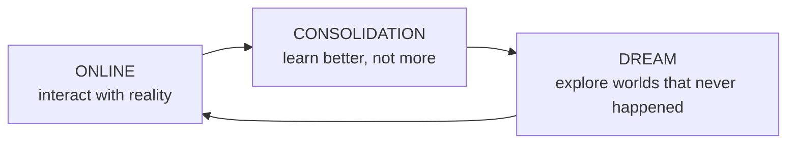

# SPEC SB-1 — the Synthetic Brain, full stack

**Status: the RPDU line is frozen. Levels 1–2 of this stack were built; everything above
Predictive Assembly is design, never implemented.** Code in [`legacy/`](../../architectures/),
results in [RESULTS.md](RESULTS.md).

This is the architecture the RPDU line was heading toward, recorded in full so that what was
actually built can be read against what it was for. It is kept because a frozen architecture
is only useful if its intent is legible — and because the DCN line inherits its shape, its
benchmark, and several of its mistakes.

---

## The idea

The Synthetic Cortex is not the whole brain. It is the **computational substrate on which
every cognitive function emerges**.

```
                    SYNTHETIC BRAIN
───────────────────────────────────────────────────────────────
                 Executive Cognitive System
      (Goals · Attention · Motivation · Curiosity · Planning)
───────────────────────────────────────────────────────────────
                    Global World Model
     (Dynamic beliefs about objects, agents, physics, self)
───────────────────────────────────────────────────────────────
                Prediction Fields (dynamic)
   Visual | Auditory | Language | Motor | Social | Abstract
             (not fixed anatomical regions)
───────────────────────────────────────────────────────────────
                    Prediction Regions
            (emergent specialisation from experience)
───────────────────────────────────────────────────────────────
                 Predictive Assemblies (PA)
        (temporary coalitions of synchronised RPDUs)
───────────────────────────────────────────────────────────────
        Recursive Predictive Dynamical Units (RPDU)
              (the universal cortical primitive)
───────────────────────────────────────────────────────────────
                  Sensory / Motor Surface
   Vision · Audio · Touch · Time · Internal state · Actions
```

**There is only one computational primitive.** Everything above it is emergent organisation
— which is, roughly, what evolution appears to have done.

## The levels

### RPDU — the universal primitive · BUILT

Every RPDU is identical. Not specialised. It knows only how to:

```
maintain state → predict → compare → learn → communicate → synchronise
```

Nothing about language. Nothing about images. Nothing about logic.

Two versions were built and both are frozen. **v1** is a gradient flow on an energy
landscape; **v2** replaces the unit dynamics with Stuart–Landau limit-cycle oscillators,
because a gradient flow has `dE/dt = -‖∇E‖² ≤ 0` and therefore provably cannot oscillate,
synchronise, or carry a moving quantity. See [SPEC_RPDU.md](SPEC_RPDU.md) and
[SPEC_PMP.md](SPEC_PMP.md).

### Predictive Assembly — the first level where cognition appears · BUILT

Not permanent. More like a flock of birds:

```
64 RPDUs → temporary synchronisation → shared hypothesis → dissolve → reform
```

Assemblies were meant to represent objects, movements, words, intentions or plans depending
on where they emerge. See [SPEC_PA.md](SPEC_PA.md); built in [`architectures/swift/pa/`](../../architectures/swift/pa/).

**What was measured.** The assembly did not add a level of abstraction. Its workspace scored
6.56x persistence where the full mesh state scored 0.69x — the compression operator, not the
units and not the hierarchy, was where the predictive information disappeared.

### Prediction Region — NOT BUILT

Several assemblies repeatedly cooperate, and a specialisation appears. Nobody programs it;
it emerges because those assemblies reduce each other's prediction error.

### Prediction Field — NOT BUILT

Functional systems, not anatomy: visual, motor, social, executive, creative, abstract
reasoning. A synthetic brain is not constrained to two hemispheres. If functional
specialisation emerges you observe it rather than hard-code it — you might find two dominant
hemisphere-like fields, or you might not.

### Global World Model — NOT BUILT

**There is no world-model database.** The world model *is* the current synchronised state of
every prediction field. It is alive, not stored.

### Executive Cognitive System — NOT BUILT

Surprisingly small. Attention, goal selection, curiosity, planning, task switching, energy
allocation — and nothing else. It never understands the world directly; it orchestrates.

## Three operating modes

The cortex is never idle. It cycles.



**ONLINE** — observe → predict → prediction error → tiny plasticity update → action.
Everything local, no major reorganisation.

**CONSOLIDATION** — replay the day, merge similar patterns, remove noise, strengthen useful
structures, compress concepts. The output is a *simpler* world model, not a bigger one.

**DREAM** — generate variations of the current world model, run them, measure stability,
keep the useful predictions and discard the impossible ones. Dreams are the simulator.

The brain improves itself continuously. No retraining, no epochs, no frozen checkpoints.

## Communication — a first-class component

The **Predictive Mesh Protocol**: every RPDU speaks the same language, and a message carries
only prediction, confidence, novelty, stability, goal relevance and time horizon. Tiny
messages, millions of them, almost like spikes. See [SPEC_PMP.md](SPEC_PMP.md).

**What was measured.** The four-scalar protocol was never shown to carry anything. An early
claim that it was inert was itself an over-claim and was retracted; the honest status is
untested rather than refuted.

## Plasticity at three timescales

| speed | what changes | scale |
|---|---|---|
| fast | internal state | milliseconds |
| medium | connection strength | minutes |
| slow | topology — new long-range links appear, old ones vanish | days |

A high-level echo of the timescales observed in biological learning, with no claim to an
exact mechanism.

## The scaling law

Today's AI scales by adding parameters. This scales by **adding interacting predictive
modules**:

```
1 RPDU → 64 (assembly) → 100 assemblies (region) → 50 regions (field)
       → several fields (synthetic cortex) → + executive & world model (synthetic brain)
```

No redesign. Just recursion.

## Outside the brain: the Developmental Curriculum Engine

One component that belongs outside the system, added because engineering needs it rather
than because biology has it.

```
              SYNTHETIC BRAIN
                    ▲
                    │
      Developmental Curriculum Engine
      · generates progressively harder worlds
      · measures developmental milestones
      · chooses what to experience next
      · controls sleep duration
      · adjusts exploration vs exploitation
      · decides when the cortex is "ready"
```

A newborn is not shown calculus on day one. Rather than hand-designing tasks forever, the
curriculum engine continually creates experiences just beyond the system's current
predictive ability. This external component may be what separates a trained model from a
developing mind.

If the RPDU is the transistor and the synthetic cortex is the processor, the developmental
curriculum is the childhood that teaches the processor to become a mind.

---

## Honest status

Ambition and evidence, kept apart on purpose.

**Built and measured:** RPDU v1, RPDU v2, Predictive Assembly, the Predictive Mesh Protocol,
five worlds, and the benchmark that scores them.

**Designed and never built:** regions, fields, the global world model, the executive system,
consolidation, dreaming, three-timescale plasticity, the curriculum engine.

**Refuted by this line's own measurements:** emergent object permanence; coalitions as the
substrate of thought; assemblies as a level of abstraction; averaging as an aggregator. Each
refutation is in [RESULTS.md](RESULTS.md) with its control.

The line is frozen — not because it was wrong to try, but because continuing to patch it
would have produced a hybrid in which no behaviour could be attributed to any hypothesis.
Its worlds, probes, baselines and gates were kept, and every one of them is what the active
architecture is now measured against.
